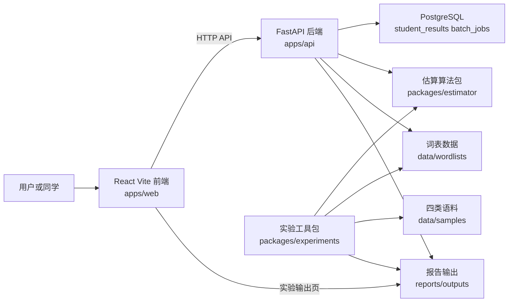
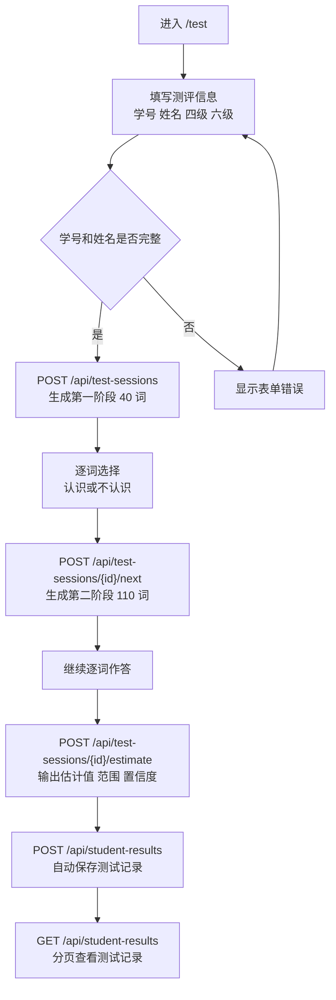
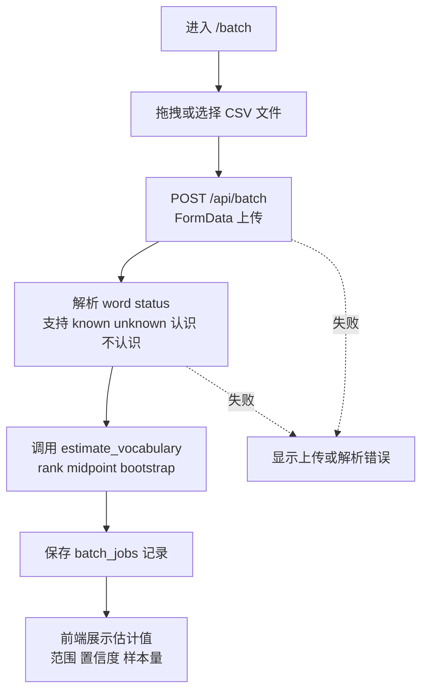
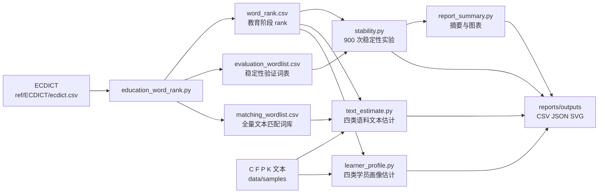
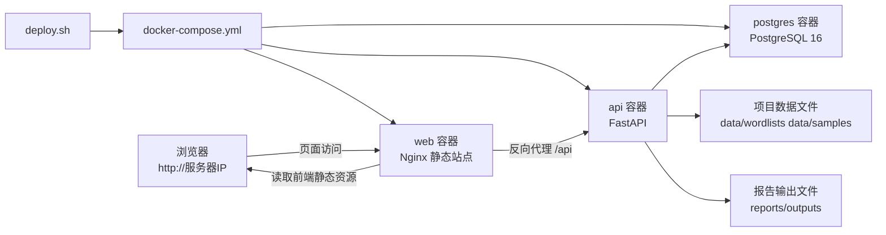

# 项目架构与流程图

本文档集中保存项目的 Mermaid 图示，便于课程报告、答辩讲解和后续维护引用。文字版说明见 `docs/technical-architecture-and-flow.md`。

## 1. 系统整体架构

```mermaid
flowchart LR
  user["用户或同学"]
  web["React Vite 前端<br/>apps/web"]
  api["FastAPI 后端<br/>apps/api"]
  db["PostgreSQL<br/>student_results batch_jobs"]
  estimator["估算算法包<br/>packages/estimator"]
  experiments["实验工具包<br/>packages/experiments"]
  wordlists["词表数据<br/>data/wordlists"]
  samples["四类语料<br/>data/samples"]
  reports["报告输出<br/>reports/outputs"]

  user --> web
  web -->|"HTTP API"| api
  api --> db
  api --> estimator
  api --> wordlists
  experiments --> estimator
  experiments --> wordlists
  experiments --> samples
  experiments --> reports
  api --> reports
  web -->|"实验输出页"| reports
```

## 2. GUI 150 词测试流程

```mermaid
flowchart TD
  start["进入 /test"]
  form["填写测评信息<br/>学号 姓名 四级 六级"]
  validate{"学号和姓名是否完整"}
  stage1["POST /api/test-sessions<br/>生成第一阶段 40 词"]
  answer1["逐词选择<br/>认识或不认识"]
  stage2["POST /api/test-sessions/{id}/next<br/>生成第二阶段 110 词"]
  answer2["继续逐词作答"]
  estimate["POST /api/test-sessions/{id}/estimate<br/>输出估计值 范围 置信度"]
  save["POST /api/student-results<br/>自动保存测试记录"]
  records["GET /api/student-results<br/>分页查看测试记录"]
  retry["显示表单错误"]

  start --> form
  form --> validate
  validate -- 否 --> retry
  retry --> form
  validate -- 是 --> stage1
  stage1 --> answer1
  answer1 --> stage2
  stage2 --> answer2
  answer2 --> estimate
  estimate --> save
  save --> records
```

## 3. CSV 批处理流程

```mermaid
flowchart TD
  batchPage["进入 /batch"]
  upload["拖拽或选择 CSV 文件"]
  postBatch["POST /api/batch<br/>FormData 上传"]
  parse["解析 word status<br/>支持 known unknown 认识 不认识"]
  estimate["调用 estimate_vocabulary<br/>rank midpoint bootstrap"]
  persist["保存 batch_jobs 记录"]
  result["前端展示估计值<br/>范围 置信度 样本量"]
  error["显示上传或解析错误"]

  batchPage --> upload
  upload --> postBatch
  postBatch --> parse
  parse --> estimate
  estimate --> persist
  persist --> result
  postBatch -. 失败 .-> error
  parse -. 失败 .-> error
```

## 4. 词库与实验报告生成流程

```mermaid
flowchart LR
  ecdict["ECDICT<br/>ref/ECDICT/ecdict.csv"]
  builder["education_word_rank.py"]
  rank["word_rank.csv<br/>教育阶段 rank"]
  evaluation["evaluation_wordlist.csv<br/>稳定性验证词表"]
  matching["matching_wordlist.csv<br/>全量文本匹配词库"]
  stability["stability.py<br/>900 次稳定性实验"]
  textEstimate["text_estimate.py<br/>四类语料文本估计"]
  learner["learner_profile.py<br/>四类学员画像估计"]
  summary["report_summary.py<br/>摘要与图表"]
  samples["C F P K 文本<br/>data/samples"]
  outputs["reports/outputs<br/>CSV JSON SVG"]

  ecdict --> builder
  builder --> rank
  builder --> evaluation
  builder --> matching
  rank --> stability
  evaluation --> stability
  rank --> textEstimate
  matching --> textEstimate
  samples --> textEstimate
  rank --> learner
  samples --> learner
  stability --> summary
  stability --> outputs
  textEstimate --> outputs
  learner --> outputs
  summary --> outputs
```

## 5. Docker 部署图

```mermaid
flowchart LR
  browser["浏览器<br/>http://服务器IP"]
  web["web 容器<br/>Nginx 静态站点"]
  api["api 容器<br/>FastAPI"]
  postgres["postgres 容器<br/>PostgreSQL 16"]
  data["项目数据文件<br/>data/wordlists data/samples"]
  reports["报告输出文件<br/>reports/outputs"]
  deploy["deploy.sh"]
  compose["docker-compose.yml"]

  deploy --> compose
  compose --> web
  compose --> api
  compose --> postgres
  browser -->|"页面访问"| web
  web -->|"反向代理 /api"| api
  api --> postgres
  api --> data
  api --> reports
  web -->|"读取前端静态资源"| browser
```
